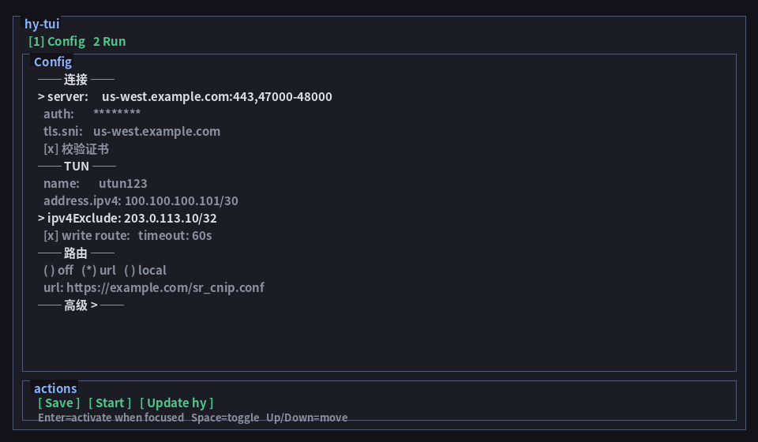

# hy-tool

Companion tooling for [hy](https://github.com/wusir27/hy). 完整字段见 [USAGE.md](https://github.com/wusir27/hy/blob/main/USAGE.md)。

## 服务端（Linux）

见 [`server/`](server/)。

```bash
bash <(curl -fsSL https://raw.githubusercontent.com/wusir27/hy-tool/main/server/install_server.sh)
```

## 客户端

见 [`client/`](client/)：终端启动器 **hy-tui**（截图与安装示例）、SOCKS5 / HTTP 手写步骤、macOS utun。

```bash
bash <(curl -fsSL https://raw.githubusercontent.com/wusir27/hy-tool/main/client/install_tui.sh)
~/.hy/bin/hy-tui
```



详细用法：[`client/tui.md`](client/tui.md)。系统流量背景：[`client/macos-utun.md`](client/macos-utun.md)。
