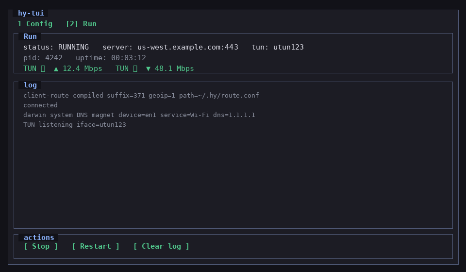

# 客户端

终端启动器 **hy-tui**（ratatui）：下载同版本 [hy](https://github.com/wusir27/hy)、写 `~/.hy/client.yaml`（可选规则），再 `sudo` 拉起 `hy client`。**不是**第二套协议客户端。

## 长什么样

**Config** — 填连接 / TUN / 路由，Save 只写 yaml，Start 才拉起 hy：


**Run** — 状态、TUN 出/入速率、`hy client` 日志；Stop / Restart：



两个 tab：`1 Config` / `2 Run`。Start 成功后切到 Run。完整字段与 sudo 说明见 [tui.md](tui.md)。

## 安装 / 打开（不需要 Rust）

```bash
bash <(curl -fsSL https://raw.githubusercontent.com/wusir27/hy-tool/main/client/install_tui.sh)
~/.hy/bin/hy-tui
```

默认装到 `~/.hy/bin/hy-tui`。也可用 `HY_TUI_TAG` / `HY_TUI_DIR`，或从 [Releases](https://github.com/wusir27/hy-tool/releases) 下匹配本机的 `hy-tui-*`。面向 **macOS / Linux**（无 Windows TUN）。

第一次打开若没有 `~/.hy/bin/hy`，会按本机从 [hy Releases](https://github.com/wusir27/hy/releases) 拉资产并用 `SHA256SUMS` 校验。

## 最短路径（示例）

1. 服务端已按 [server](../server/) 跑起来，版本与客户端 `hy` 一致。
2. Config **连接**：`server`（如 `203.0.113.10:443`）、`auth`、`tls.sni`；试验自签可关「校验证书」。
3. **TUN**：Darwin 默认 `utun123`；`ipv4Exclude` 改成**服务器公网 IP/32**（不要留 `YOUR_SERVER_PUBLIC_IP/32`）。
4. 需要系统默认路由时保持 **write route:**；规则选 `url` / `local` / `off`（见 [tui.md](tui.md) §5）。
5. **Save** → **Start**（按提示输入本机 sudo 密码）→ Run 里看 `connected` / TUN 速率。

手写 yaml / 只要 SOCKS5：[client.md](client.md)。macOS utun 背景：[macos-utun.md](macos-utun.md)。示例配置：[examples/client.yaml](examples/client.yaml)、[examples/client-macos-utun.yaml](examples/client-macos-utun.yaml)。

```bash
# 可选：只装 TUI 后手动指定 hy 路径（高级 → hy path），或：
# bash <(curl -fsSL https://raw.githubusercontent.com/wusir27/hy-tool/main/client/install_tui.sh)
```
